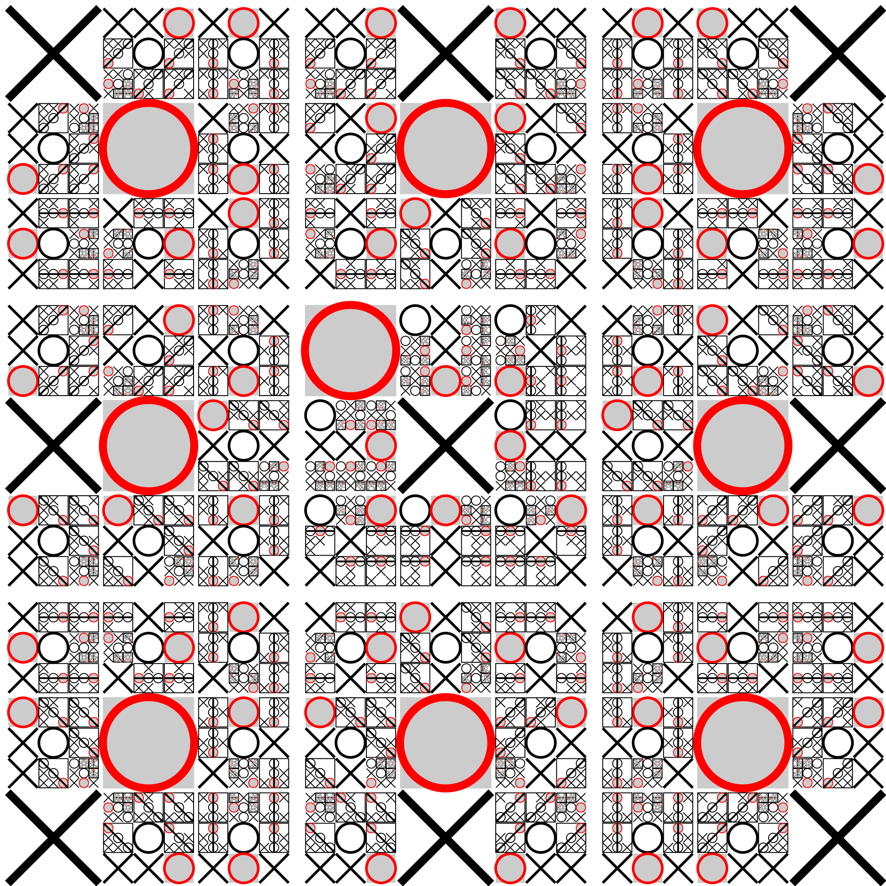

# XCI Tic Tac Toe

This is a player vs. computer version of Tic Tac Toe using the [XCI Game Engine](https://github.com/SlithyMatt/x16-xci).

It's not possible to win, but you can lose if you don't play a perfect game! The opening level of this game implements the state machine specified by this image found on [Wikipedia](https://en.wikipedia.org/wiki/Tic-tac-toe):

Now, some gameplay GIFs:

